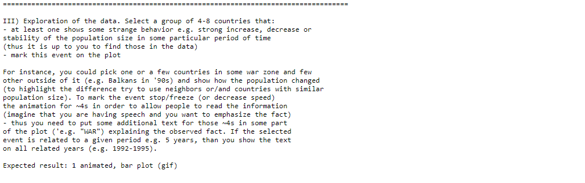

 Report img { border: 3px solid black; }

_Made by Krzysztof Zdąbłasz_

Lab 1
=====

Task 2
======

### Task definition:

### About my solution:

All scripts have similar structure - one main class, that slightly differs between them.  
Scripts create and save series of plots to a directory that must be specified by the user.  
Scripts parse data from manualy corrected CSV downloaded from The World Bank (groups filtered out, some unnecessary lines deleted).  
In tasks **b** and **c**, 4 'closest countries' are 2 with higher populations and 2 with lower populations than the selected one.  
Each run of **b** and **c** should return different results, because countries and years are randomly chosen in a runtime.  
Saved images has been converted into .gif file using _convert -delay 15 \*.png final\_output.gif_ .

a)
--

b)
--

c)
--

Lab 2
=====

Task 1
======

### Task definition:

### About my solution:

Scripts have similar structure to those from lab 1, but now matplotlib.animation is being used instead of saving images to files. Important thing to mention is that those scripts might sometimes return bugged plots. This is probably caused by some data-reading bug (because some countries have an incomplete population data).  
In such case, the script should be run again and it should work.

Colored
-------

a)
--

b)
--

c)
--

B&W
---

a)
--

b)
--

c)
--

Task 2
======

### Task definition:

### About my solution:

Again, scripts are somewhat similar to the original ones.  
In the line plot, I positioned country codes to be on the right side of the lines, instead of being above them. In my opinion this is a better solution, because country codes (almost) do not overlap. Unfortunately, I forgot to add a legend.  
Bubble plot is probably the least readable one. It lacks a legend and a proper desription (especially about countries density). Country codes overlap with bubbles and it looks messy.  
I might have not understood the task correctly. Also it takes the most time to be generated.  
One thing I should mention is that the x-axis is not labeled 'years' in any of those plots. However, I did that on purpose as it is obvious and may be deducted by reading the main titles.

a) Line plot
------------

b) Bubble plot
--------------

c) Pie chart
------------

Lab 3
=====

Task 3
======

### Task definition:

Breakup of Yugoslavia plot
--------------------------

Task 4
======

### Task definition:

### About my solution:

I've translated, modified and grouped data and saved them to file 'caledar\_year\_table.csv'.  
While working with the plot, I decided that placing labels inside the bars would make it unreadable.  
One option was to create the arrow annotations, but each one of those would have to be implicilty positioned inside the script.  
It would probably be way faster to make those annotations using Paint or any other easy graphic editor.  
I could also assign unique numbers to each event, position them on the plot, and create a table on the side of the plot, but after all I think that it would require too much work.  
Thus, I did not make any labels at all. In my opinion, this plot would look way better using an interactive visualization.  

a) Colored Gannt plot
---------------------

a) B&W Gannt plot
-----------------

